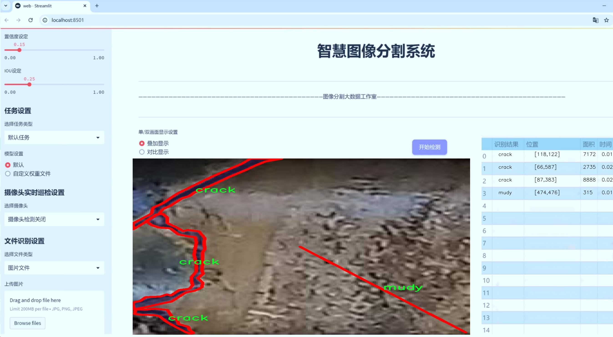
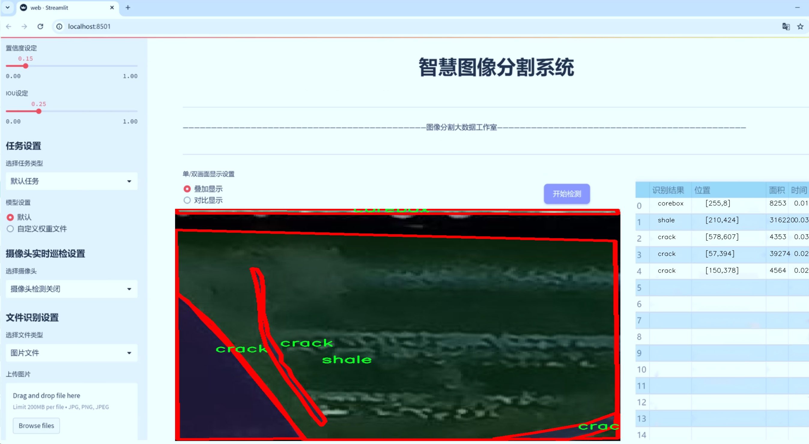
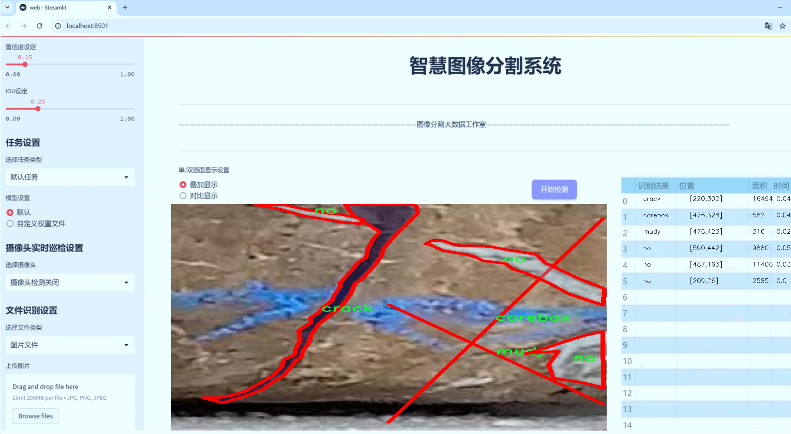
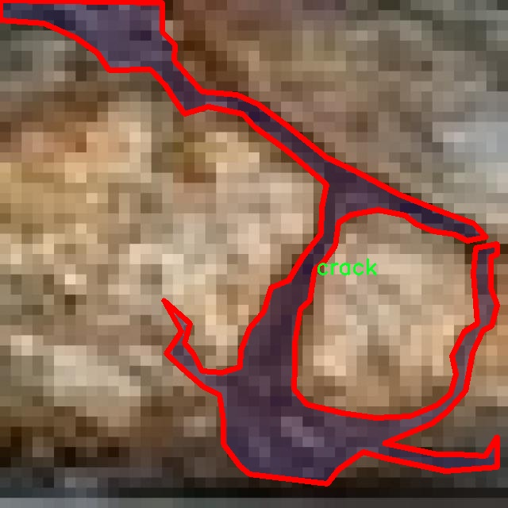
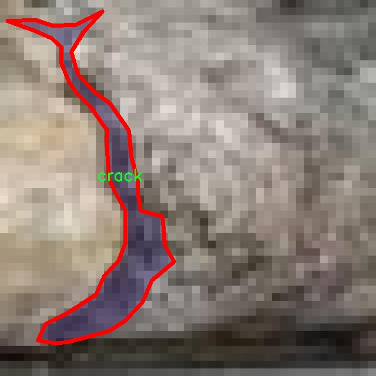
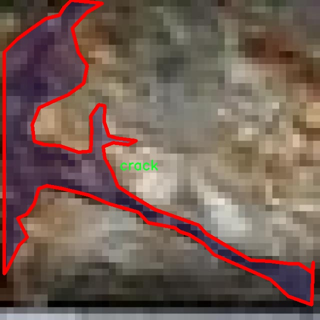
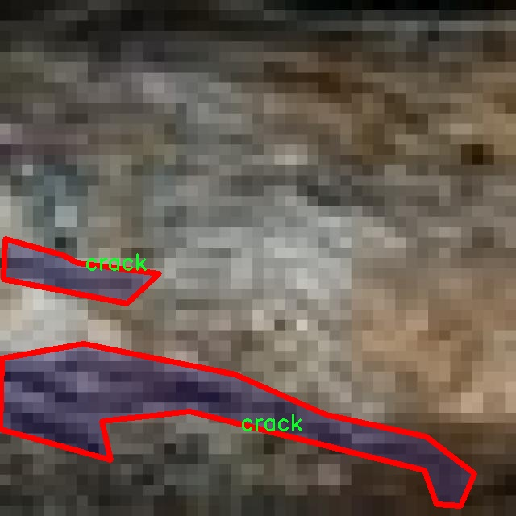
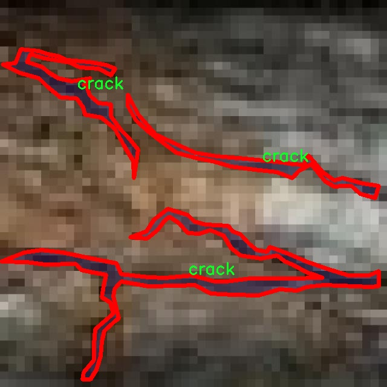

# 裂缝检测与分割系统源码＆数据集分享
 [yolov8-seg-timm＆yolov8-seg-KernelWarehouse等50+全套改进创新点发刊_一键训练教程_Web前端展示]

### 1.研究背景与意义

项目参考[ILSVRC ImageNet Large Scale Visual Recognition Challenge](https://gitee.com/YOLOv8_YOLOv11_Segmentation_Studio/projects)

项目来源[AAAI Global Al lnnovation Contest](https://kdocs.cn/l/cszuIiCKVNis)

研究背景与意义

随着城市化进程的加快，基础设施的建设与维护变得愈发重要。裂缝作为一种常见的结构性损伤，往往是导致建筑物和道路等基础设施失效的前兆。因此，及时、准确地检测和分割裂缝，不仅可以为工程维护提供重要依据，还能有效延长结构物的使用寿命，降低维护成本。传统的裂缝检测方法多依赖人工观察和经验判断，存在效率低、主观性强等缺陷。近年来，随着计算机视觉和深度学习技术的迅猛发展，基于图像处理的自动化裂缝检测方法逐渐成为研究热点。

YOLO（You Only Look Once）系列模型因其高效的实时检测能力而受到广泛关注。YOLOv8作为该系列的最新版本，具备更强的特征提取能力和更快的推理速度，适合于处理复杂的裂缝检测任务。然而，尽管YOLOv8在目标检测领域表现出色，但在裂缝的精确分割和分类方面仍存在一定的局限性。为此，基于改进YOLOv8的裂缝检测与分割系统的研究显得尤为重要。

本研究将采用“detectron2_crack_All”数据集，该数据集包含3000幅图像，涵盖8个类别，包括核心盒、裂缝、深度、空白、泥土、无、页岩和水等。这些类别的多样性为裂缝检测提供了丰富的场景，能够有效提升模型的泛化能力。通过对该数据集的深入分析，我们可以识别出不同类型裂缝的特征，从而为模型的改进提供数据支持。

在研究中，我们将重点关注如何优化YOLOv8的网络结构，以提高其在裂缝检测与分割任务中的表现。具体而言，我们将引入注意力机制和多尺度特征融合策略，以增强模型对细小裂缝的识别能力。同时，通过数据增强技术提升模型的鲁棒性，使其在不同环境下均能保持良好的检测性能。此外，我们还将探讨如何通过迁移学习等方法，利用已有的预训练模型加速训练过程，提高模型的收敛速度。

本研究的意义不仅在于提升裂缝检测的准确性和效率，更在于为基础设施的智能化监测提供一种新的解决方案。通过构建基于改进YOLOv8的裂缝检测与分割系统，我们希望能够为工程实践提供可行的技术支持，推动智能监测技术在基础设施维护中的应用。同时，研究成果将为后续相关领域的研究提供借鉴，促进计算机视觉技术在更多实际场景中的应用，推动基础设施智能化管理的发展。

综上所述，基于改进YOLOv8的裂缝检测与分割系统的研究，不仅具有重要的理论价值，也具有广泛的实际应用前景。通过对裂缝检测技术的深入探索，我们期望能够为城市基础设施的安全与可持续发展贡献一份力量。

### 2.图片演示







##### 注意：由于此博客编辑较早，上面“2.图片演示”和“3.视频演示”展示的系统图片或者视频可能为老版本，新版本在老版本的基础上升级如下：（实际效果以升级的新版本为准）

  （1）适配了YOLOV8的“目标检测”模型和“实例分割”模型，通过加载相应的权重（.pt）文件即可自适应加载模型。

  （2）支持“图片识别”、“视频识别”、“摄像头实时识别”三种识别模式。

  （3）支持“图片识别”、“视频识别”、“摄像头实时识别”三种识别结果保存导出，解决手动导出（容易卡顿出现爆内存）存在的问题，识别完自动保存结果并导出到tempDir中。

  （4）支持Web前端系统中的标题、背景图等自定义修改，后面提供修改教程。

  另外本项目提供训练的数据集和训练教程,暂不提供权重文件（best.pt）,需要您按照教程进行训练后实现图片演示和Web前端界面演示的效果。

### 3.视频演示

[3.1 视频演示](https://www.bilibili.com/video/BV1dc2hYiED1/)

### 4.数据集信息展示

##### 4.1 本项目数据集详细数据（类别数＆类别名）

nc: 8
names: ['corebox', 'crack', 'depth', 'empty', 'mudy', 'no', 'shale', 'water']


##### 4.2 本项目数据集信息介绍

数据集信息展示

在现代计算机视觉领域，裂缝检测与分割任务的准确性和效率至关重要。为此，我们构建了一个名为“detectron2_crack_All”的数据集，旨在为改进YOLOv8-seg模型提供丰富的训练素材。该数据集专注于多种裂缝及其相关特征的检测与分割，涵盖了八个不同的类别，分别为：corebox、crack、depth、empty、mudy、no、shale和water。这些类别不仅反映了裂缝的多样性，还涵盖了与裂缝相关的环境特征，确保模型能够在各种条件下进行有效的学习和推理。

在数据集的构建过程中，我们特别注重数据的多样性和代表性。每个类别都包含了大量的标注样本，这些样本来源于不同的地质环境和裂缝类型，确保模型在训练过程中能够接触到各种可能的情况。例如，类别“crack”专门标注了不同形态和大小的裂缝，而“depth”则涵盖了裂缝的深度信息，这对于后续的分析和评估至关重要。通过这种方式，数据集不仅提供了裂缝的基本信息，还帮助模型理解裂缝在不同环境下的表现。

此外，类别“corebox”用于标识裂缝检测中的核心区域，能够帮助模型聚焦于重要的特征区域，而“empty”类别则标注了无裂缝的区域，确保模型能够有效地区分裂缝与非裂缝区域。其他类别如“mudy”、“shale”和“water”则代表了不同的地质材料和环境条件，这些信息对于裂缝的形成和发展有着重要的影响。通过将这些类别纳入数据集中，我们希望模型能够学习到更为复杂的环境特征，从而提高其在实际应用中的适应性和准确性。

在数据集的标注过程中，我们采用了高标准的标注流程，确保每个样本的标注准确无误。所有标注均由经验丰富的地质专家完成，他们对裂缝及其相关特征有着深刻的理解。这一过程不仅提高了数据集的质量，也为后续的模型训练提供了坚实的基础。

为了方便研究人员和开发者使用，我们对数据集进行了精心的组织和管理。数据集的结构清晰，易于访问，用户可以方便地获取所需的样本进行训练和测试。此外，我们还提供了详细的文档，说明了数据集的使用方法和注意事项，确保用户能够充分利用这一资源。

总之，“detectron2_crack_All”数据集为裂缝检测与分割任务提供了一个全面、丰富的训练基础。通过涵盖多种类别和环境特征，该数据集不仅有助于提高YOLOv8-seg模型的性能，也为相关领域的研究提供了宝贵的数据支持。我们期待这一数据集能够推动裂缝检测技术的发展，助力更高效的工程应用和地质研究。











### 5.全套项目环境部署视频教程（零基础手把手教学）

[5.1 环境部署教程链接（零基础手把手教学）](https://www.bilibili.com/video/BV1jG4Ve4E9t/?vd_source=bc9aec86d164b67a7004b996143742dc)


[5.2 安装Python虚拟环境创建和依赖库安装视频教程链接（零基础手把手教学）](https://www.bilibili.com/video/BV1nA4VeYEze/?vd_source=bc9aec86d164b67a7004b996143742dc)

### 6.手把手YOLOV8-seg训练视频教程（零基础小白有手就能学会）

[6.1 手把手YOLOV8-seg训练视频教程（零基础小白有手就能学会）](https://www.bilibili.com/video/BV1cA4VeYETe/?vd_source=bc9aec86d164b67a7004b996143742dc)


按照上面的训练视频教程链接加载项目提供的数据集，运行train.py即可开始训练



     Epoch   gpu_mem       box       obj       cls    labels  img_size
     1/200     0G   0.01576   0.01955  0.007536        22      1280: 100%|██████████| 849/849 [14:42<00:00,  1.04s/it]
               Class     Images     Labels          P          R     mAP@.5 mAP@.5:.95: 100%|██████████| 213/213 [01:14<00:00,  2.87it/s]
                 all       3395      17314      0.994      0.957      0.0957      0.0843

     Epoch   gpu_mem       box       obj       cls    labels  img_size
     2/200     0G   0.01578   0.01923  0.007006        22      1280: 100%|██████████| 849/849 [14:44<00:00,  1.04s/it]
               Class     Images     Labels          P          R     mAP@.5 mAP@.5:.95: 100%|██████████| 213/213 [01:12<00:00,  2.95it/s]
                 all       3395      17314      0.996      0.956      0.0957      0.0845

     Epoch   gpu_mem       box       obj       cls    labels  img_size
     3/200     0G   0.01561    0.0191  0.006895        27      1280: 100%|██████████| 849/849 [10:56<00:00,  1.29it/s]
               Class     Images     Labels          P          R     mAP@.5 mAP@.5:.95: 100%|███████   | 187/213 [00:52<00:00,  4.04it/s]
                 all       3395      17314      0.996      0.957      0.0957      0.0845


### 7.50+种全套YOLOV8-seg创新点代码加载调参视频教程（一键加载写好的改进模型的配置文件）

[7.1 50+种全套YOLOV8-seg创新点代码加载调参视频教程（一键加载写好的改进模型的配置文件）](https://www.bilibili.com/video/BV1Hw4VePEXv/?vd_source=bc9aec86d164b67a7004b996143742dc)

### 8.YOLOV8-seg图像分割算法原理

原始YOLOv8-seg算法原理

YOLOv8-seg算法是目标检测领域中的一项重要进展，建立在YOLO系列算法的基础上，特别是YOLOv5和YOLOv7的成功经验之上。作为一种先进的卷积神经网络（CNN）模型，YOLOv8-seg不仅专注于目标检测，还引入了图像分割的能力，使其在处理复杂场景时表现得更加出色。该算法的设计理念是通过高效的特征提取和融合策略，来提升目标检测和分割的精度与速度。

YOLOv8-seg的网络结构依然遵循了YOLO系列的经典架构，包括输入层、主干网络、特征融合层和解耦头（head）。其主干网络采用了CSPDarknet的思想，进一步优化了特征提取的效率。具体而言，YOLOv8-seg在YOLOv5的基础上，将C3模块替换为C2f模块，以实现更轻量化的设计，同时确保检测精度不受影响。C2f模块的设计灵感来源于YOLOv7的ELAN思想，通过引入多个shortcut连接，增强了梯度流动，缓解了深层网络中的梯度消失问题，从而提高了模型的训练效果。

在特征融合方面，YOLOv8-seg采用了PAN-FPN结构，这种结构能够有效地融合不同层次的特征信息，确保模型在多尺度目标检测中具备更强的能力。PAN-FPN通过自下而上的方式将高层特征与中层和浅层特征进行融合，使得模型能够充分利用各层特征的优势。值得注意的是，YOLOv8-seg在上采样阶段去掉了YOLOv5中的1x1卷积，直接将高层特征进行上采样并与中层特征进行拼接，这种设计使得特征融合更加高效，进一步提升了目标检测的准确性。

YOLOv8-seg的一个显著特点是其采用了Anchor-Free的思想，摒弃了传统的Anchor-Base方法。这一创新使得模型在处理不同大小和形状的目标时更加灵活，能够自适应地进行目标检测和分割。通过这种方式，YOLOv8-seg能够更好地应对复杂的场景变化，提高了模型的鲁棒性。

在损失函数的设计上，YOLOv8-seg引入了VFLLoss作为分类损失，同时结合DFLLoss和CIoULoss来优化边框回归。这种损失函数的组合不仅能够有效地解决样本不平衡问题，还能提高模型对难以分类样本的敏感性，从而提升整体检测性能。此外，YOLOv8-seg在样本匹配策略上进行了创新，将静态匹配改为TaskAligned的Assigner匹配方式，这一改进使得模型在训练过程中能够更好地适应不同的任务需求。

在数据预处理方面，YOLOv8-seg采用了YOLOv5的策略，包括马赛克增强、混合增强、空间扰动和颜色扰动等多种数据增强手段。这些增强方法能够有效地提高模型的泛化能力，使其在实际应用中表现得更加稳健。尽管本文在实验中未启用数据预处理，但这些策略在YOLOv8-seg的训练过程中起到了重要的作用。

在特征提取过程中，YOLOv8-seg通过卷积、归一化和SiLU激活函数的组合，能够有效地提取目标的纹理和颜色信息。特别是SiLU激活函数的引入，提升了模型的非线性变换能力，使得网络能够更好地学习复杂的特征表示。此外，C2f模块的设计确保了输入和输出特征图的尺寸一致，便于后续的特征融合和处理。

YOLOv8-seg的Head部分借鉴了YOLOX和YOLOv6的解耦头设计，取消了objectness分支，通过边框回归和目标分类两个部分进行解耦。这一设计使得模型在处理目标检测和分割任务时更加高效，能够快速生成高质量的检测结果。YOLOv8-seg的输出特征图尺寸为80x80、40x40和20x20，确保了在不同尺度下的目标检测和分割能力。

在面对复杂场景时，YOLOv8-seg的性能得到了显著提升。通过引入Focal Loss损失函数，YOLOv8-seg能够有效地处理样本不平衡问题，特别是在小目标检测中，Focal Loss能够聚焦于难以分类的样本，提高模型的学习效率和准确性。这种设计使得YOLOv8-seg在实际应用中表现得更加出色，能够在智能监控、自动驾驶和人脸识别等多个领域中广泛应用。

综上所述，YOLOv8-seg算法通过一系列创新的设计和优化，成功地将目标检测与图像分割相结合，形成了一种高效、准确的目标检测模型。其在特征提取、特征融合、损失函数和样本匹配等方面的改进，使得YOLOv8-seg在处理复杂场景时具备了更强的能力，为目标检测领域的发展提供了新的思路和方向。


### 9.系统功能展示（检测对象为举例，实际内容以本项目数据集为准）

图9.1.系统支持检测结果表格显示

  图9.2.系统支持置信度和IOU阈值手动调节

  图9.3.系统支持自定义加载权重文件best.pt(需要你通过步骤5中训练获得)

  图9.4.系统支持摄像头实时识别

  图9.5.系统支持图片识别

  图9.6.系统支持视频识别

  图9.7.系统支持识别结果文件自动保存

  图9.8.系统支持Excel导出检测结果数据


### 10.50+种全套YOLOV8-seg创新点原理讲解（非科班也可以轻松写刊发刊，V11版本正在科研待更新）

#### 10.1 由于篇幅限制，每个创新点的具体原理讲解就不一一展开，具体见下列网址中的创新点对应子项目的技术原理博客网址【Blog】：


[10.1 50+种全套YOLOV8-seg创新点原理讲解链接](https://gitee.com/qunmasj/good)

#### 10.2 部分改进模块原理讲解(完整的改进原理见上图和技术博客链接)【如果此小节的图加载失败可以通过CSDN或者Github搜索该博客的标题访问原始博客，原始博客图片显示正常】
### FasterNet简介
神经网络在图像分类、检测和分割等各种计算机视觉任务中经历了快速发展。尽管其令人印象深刻的性能为许多应用程序提供了动力，但一个巨大的趋势是追求具有低延迟和高吞吐量的快速神经网络，以获得良好的用户体验、即时响应和安全原因等。

如何快速？研究人员和从业者不需要更昂贵的计算设备，而是倾向于设计具有成本效益的快速神经网络，降低计算复杂度，主要以浮点运算（FLOPs）的数量来衡量。

MobileNet、ShuffleNet和GhostNet等利用深度卷积（DWConv）和/或组卷积（GConv）来提取空间特征。然而，在减少FLOPs的过程中，算子经常会受到内存访问增加的副作用的影响。MicroNet进一步分解和稀疏网络，将其FLOPs推至极低水平。尽管这种方法在FLOPs方面有所改进，但其碎片计算效率很低。此外，上述网络通常伴随着额外的数据操作，如级联、Shuffle和池化，这些操作的运行时间对于小型模型来说往往很重要。

除了上述纯卷积神经网络（CNNs）之外，人们对使视觉Transformer（ViTs）和多层感知器（MLP）架构更小更快也越来越感兴趣。例如，MobileViT和MobileFormer通过将DWConv与改进的注意力机制相结合，降低了计算复杂性。然而，它们仍然受到DWConv的上述问题的困扰，并且还需要修改的注意力机制的专用硬件支持。使用先进但耗时的标准化和激活层也可能限制其在设备上的速度。

所有这些问题一起导致了以下问题：这些“快速”的神经网络真的很快吗？为了回答这个问题，作者检查了延迟和FLOPs之间的关系，这由


其中FLOPS是每秒浮点运算的缩写，作为有效计算速度的度量。虽然有许多减少FLOPs的尝试，但都很少考虑同时优化FLOPs以实现真正的低延迟。为了更好地理解这种情况，作者比较了Intel CPU上典型神经网络的FLOPS。


图中的结果表明，许多现有神经网络的FLOPS较低，其FLOPS通常低于流行的ResNet50。由于FLOPS如此之低，这些“快速”的神经网络实际上不够快。它们的FLOPs减少不能转化为延迟的确切减少量。在某些情况下，没有任何改善，甚至会导致更糟的延迟。例如，CycleMLP-B1具有ResNet50的一半FLOPs，但运行速度较慢（即CycleMLPB1与ResNet50:111.9ms与69.4ms）。

请注意，FLOPs与延迟之间的差异在之前的工作中也已被注意到，但由于它们采用了DWConv/GConv和具有低FLOPs的各种数据处理，因此部分问题仍未解决。人们认为没有更好的选择。

该博客提供的方案通过开发一种简单、快速、有效的运算符来消除这种差异，该运算符可以在减少FLOPs的情况下保持高FLOPS。

具体来说，作者重新审视了现有的操作符，特别是DWConv的计算速度——FLOPS。作者发现导致低FLOPS问题的主要原因是频繁的内存访问。然后，作者提出了PConv作为一种竞争性替代方案，它减少了计算冗余以及内存访问的数量。

图1说明了PConv的设计。它利用了特征图中的冗余，并系统地仅在一部分输入通道上应用规则卷积（Conv），而不影响其余通道。本质上，PConv的FLOPs低于常规Conv，而FLOPs高于DWConv/GConv。换句话说，PConv更好地利用了设备上的计算能力。PConv在提取空间特征方面也很有效，这在本文后面的实验中得到了验证。

作者进一步引入PConv设计了FasterNet作为一个在各种设备上运行速度非常快的新网络家族。特别是，FasterNet在分类、检测和分割任务方面实现了最先进的性能，同时具有更低的延迟和更高的吞吐量。例如，在GPU、CPU和ARM处理器上，小模型FasterNet-T0分别比MobileVitXXS快3.1倍、3.1倍和2.5倍，而在ImageNet-1k上的准确率高2.9%。大模型FasterNet-L实现了83.5%的Top-1精度，与Swin-B不相上下，同时在GPU上提供了49%的高吞吐量，在CPU上节省了42%的计算时间。

总之，贡献如下：

指出了实现更高FLOPS的重要性，而不仅仅是为了更快的神经网络而减少FLOPs。

引入了一种简单但快速且有效的卷积PConv，它很有可能取代现有的选择DWConv。

推出FasterNet，它在GPU、CPU和ARM处理器等多种设备上运行良好且普遍快速。

对各种任务进行了广泛的实验，并验证了PConv和FasterNet的高速性和有效性。

### Conv和FasterNet的设计
#### 原理

DWConv是Conv的一种流行变体，已被广泛用作许多神经网络的关键构建块。对于输入，DWConv应用个滤波器来计算输出。如图（b）所示，每个滤波器在一个输入通道上进行空间滑动，并对一个输出通道做出贡献。

与具有的FLOPs常规Conv相比，这种深度计算使得DWConv仅仅具有的FLOPs。虽然在减少FLOPs方面有效，但DWConv（通常后跟逐点卷积或PWConv）不能简单地用于替换常规Conv，因为它会导致严重的精度下降。因此，在实践中，DWConv的通道数（或网络宽度）增加到＞以补偿精度下降，例如，倒置残差块中的DWConv宽度扩展了6倍。然而，这会导致更高的内存访问，这会造成不可忽略的延迟，并降低总体计算速度，尤其是对于I/O绑定设备。特别是，内存访问的数量现在上升到


它比一个常规的Conv的值要高，即，


注意，内存访问花费在I/O操作上，这被认为已经是最小的成本，很难进一步优化。

#### PConv作为一个基本的算子


在下面演示了通过利用特征图的冗余度可以进一步优化成本。如图所示，特征图在不同通道之间具有高度相似性。许多其他著作也涵盖了这种冗余，但很少有人以简单而有效的方式充分利用它。


具体而言，作者提出了一种简单的PConv，以同时减少计算冗余和内存访问。图4中的左下角说明了PConv的工作原理。它只需在输入通道的一部分上应用常规Conv进行空间特征提取，并保持其余通道不变。对于连续或规则的内存访问，将第一个或最后一个连续的通道视为整个特征图的代表进行计算。在不丧失一般性的情况下认为输入和输出特征图具有相同数量的通道。因此，PConv的FLOPs仅


对于典型的r＝1/4 ，PConv的FLOPs只有常规Conv的1/16。此外，PConv的内存访问量较小，即：


对于r＝1/4，其仅为常规Conv的1/4。

由于只有通道用于空间特征提取，人们可能会问是否可以简单地移除剩余的（c−）通道？如果是这样，PConv将退化为具有较少通道的常规Conv，这偏离了减少冗余的目标。

请注意，保持其余通道不变，而不是从特征图中删除它们。这是因为它们对后续PWConv层有用，PWConv允许特征信息流经所有通道。

#### PConv之后是PWConv


为了充分有效地利用来自所有通道的信息，进一步将逐点卷积（PWConv）附加到PConv。它们在输入特征图上的有效感受野看起来像一个T形Conv，与均匀处理补丁的常规Conv相比，它更专注于中心位置，如图5所示。为了证明这个T形感受野的合理性，首先通过计算位置的Frobenius范数来评估每个位置的重要性。


假设，如果一个职位比其他职位具有更大的Frobenius范数，则该职位往往更重要。对于正则Conv滤波器，位置处的Frobenius范数由计算，其中。


一个显著位置是具有最大Frobenius范数的位置。然后，在预训练的ResNet18中集体检查每个过滤器，找出它们的显著位置，并绘制显著位置的直方图。图6中的结果表明，中心位置是过滤器中最常见的突出位置。换句话说，中心位置的权重比周围的更重。这与集中于中心位置的T形计算一致。

虽然T形卷积可以直接用于高效计算，但作者表明，将T形卷积分解为PConv和PWConv更好，因为该分解利用了滤波器间冗余并进一步节省了FLOPs。对于相同的输入和输出，T形Conv的FLOPs可以计算为:


它高于PConv和PWConv的流量，即：


其中和（例如，当时）。此外，可以很容易地利用常规Conv进行两步实现。

# FasterNet作为Backbone
鉴于新型PConv和现成的PWConv作为主要的算子，进一步提出FasterNet，这是一个新的神经网络家族，运行速度非常快，对许多视觉任务非常有效。目标是使体系结构尽可能简单，使其总体上对硬件友好。


在图中展示了整体架构。它有4个层次级，每个层次级前面都有一个嵌入层（步长为4的常规4×4卷积）或一个合并层（步长为2的常规2×2卷积），用于空间下采样和通道数量扩展。每个阶段都有一堆FasterNet块。作者观察到，最后两个阶段中的块消耗更少的内存访问，并且倾向于具有更高的FLOPS，如表1中的经验验证。因此，放置了更多FasterNet块，并相应地将更多计算分配给最后两个阶段。每个FasterNet块有一个PConv层，后跟2个PWConv（或Conv 1×1）层。它们一起显示为倒置残差块，其中中间层具有扩展的通道数量，并且放置了Shorcut以重用输入特征。

除了上述算子，标准化和激活层对于高性能神经网络也是不可或缺的。然而，许多先前的工作在整个网络中过度使用这些层，这可能会限制特征多样性，从而损害性能。它还可以降低整体计算速度。相比之下，只将它们放在每个中间PWConv之后，以保持特征多样性并实现较低的延迟。

此外，使用批次归一化（BN）代替其他替代方法。BN的优点是，它可以合并到其相邻的Conv层中，以便更快地进行推断，同时与其他层一样有效。对于激活层，根据经验选择了GELU用于较小的FasterNet变体，而ReLU用于较大的FasterNet变体，同时考虑了运行时间和有效性。最后三个层，即全局平均池化、卷积1×1和全连接层，一起用于特征转换和分类。

为了在不同的计算预算下提供广泛的应用，提供FasterNet的Tiny模型、Small模型、Medium模型和Big模型变体，分别称为FasterNetT0/1/2、FasterNet-S、FasterNet-M和FasterNet-L。它们具有相似的结构，但深度和宽度不同。

架构规范如下：


### 11.项目核心源码讲解（再也不用担心看不懂代码逻辑）

#### 11.1 ultralytics\nn\backbone\efficientViT.py

以下是对代码中最核心部分的提取和详细注释。主要保留了模型的结构和前向传播的实现，去掉了一些不必要的细节。

```python
import torch
import torch.nn as nn
import torch.nn.functional as F
from timm.models.layers import SqueezeExcite

# 定义卷积层 + 批归一化的组合
class Conv2d_BN(torch.nn.Sequential):
    def __init__(self, in_channels, out_channels, kernel_size=1, stride=1, padding=0, dilation=1, groups=1, bn_weight_init=1):
        super().__init__()
        # 添加卷积层
        self.add_module('conv', torch.nn.Conv2d(in_channels, out_channels, kernel_size, stride, padding, dilation, groups, bias=False))
        # 添加批归一化层
        self.add_module('bn', torch.nn.BatchNorm2d(out_channels))
        # 初始化批归一化的权重
        torch.nn.init.constant_(self.bn.weight, bn_weight_init)
        torch.nn.init.constant_(self.bn.bias, 0)

    @torch.no_grad()
    def switch_to_deploy(self):
        # 将训练模式下的卷积和批归一化合并为一个卷积层
        conv, bn = self._modules.values()
        w = bn.weight / (bn.running_var + bn.eps)**0.5
        w = conv.weight * w[:, None, None, None]
        b = bn.bias - bn.running_mean * bn.weight / (bn.running_var + bn.eps)**0.5
        return torch.nn.Conv2d(w.size(1) * conv.groups, w.size(0), w.shape[2:], stride=conv.stride, padding=conv.padding, dilation=conv.dilation, groups=conv.groups, bias=True).weight.data.copy_(w), b

# 定义Patch合并模块
class PatchMerging(torch.nn.Module):
    def __init__(self, dim, out_dim):
        super().__init__()
        # 使用卷积层和激活函数进行特征提取
        self.conv1 = Conv2d_BN(dim, dim * 4, kernel_size=1)
        self.act = nn.ReLU()
        self.conv2 = Conv2d_BN(dim * 4, dim * 4, kernel_size=3, stride=2, padding=1, groups=dim * 4)
        self.se = SqueezeExcite(dim * 4, .25)  # Squeeze-and-Excitation模块
        self.conv3 = Conv2d_BN(dim * 4, out_dim, kernel_size=1)

    def forward(self, x):
        # 前向传播
        x = self.conv3(self.se(self.act(self.conv2(self.act(self.conv1(x))))))
        return x

# 定义前馈网络
class FFN(torch.nn.Module):
    def __init__(self, in_dim, hidden_dim):
        super().__init__()
        self.pw1 = Conv2d_BN(in_dim, hidden_dim)
        self.act = nn.ReLU()
        self.pw2 = Conv2d_BN(hidden_dim, in_dim, bn_weight_init=0)

    def forward(self, x):
        # 前向传播
        x = self.pw2(self.act(self.pw1(x)))
        return x

# 定义EfficientViT的基本模块
class EfficientViTBlock(torch.nn.Module):
    def __init__(self, embed_dim, key_dim, num_heads):
        super().__init__()
        self.dw0 = Conv2d_BN(embed_dim, embed_dim, kernel_size=3, groups=embed_dim)  # 深度卷积
        self.ffn0 = FFN(embed_dim, embed_dim * 2)  # 前馈网络
        self.mixer = LocalWindowAttention(embed_dim, key_dim, num_heads)  # 局部窗口注意力
        self.dw1 = Conv2d_BN(embed_dim, embed_dim, kernel_size=3, groups=embed_dim)  # 深度卷积
        self.ffn1 = FFN(embed_dim, embed_dim * 2)  # 前馈网络

    def forward(self, x):
        # 前向传播
        x = self.ffn1(self.dw1(self.mixer(self.ffn0(self.dw0(x)))))
        return x

# 定义EfficientViT模型
class EfficientViT(torch.nn.Module):
    def __init__(self, img_size=400, embed_dim=[64, 128, 192], depth=[1, 2, 3], num_heads=[4, 4, 4]):
        super().__init__()
        self.patch_embed = Conv2d_BN(3, embed_dim[0] // 8, kernel_size=3, stride=2, padding=1)  # 图像嵌入
        self.blocks = nn.ModuleList()  # 存储多个EfficientViTBlock
        for i in range(len(depth)):
            for _ in range(depth[i]):
                self.blocks.append(EfficientViTBlock(embed_dim[i], embed_dim[i] // num_heads[i], num_heads[i]))

    def forward(self, x):
        x = self.patch_embed(x)  # 图像嵌入
        for block in self.blocks:
            x = block(x)  # 通过每个块
        return x

# 示例模型创建
if __name__ == '__main__':
    model = EfficientViT(img_size=224, embed_dim=[64, 128, 192], depth=[1, 2, 3], num_heads=[4, 4, 4])
    inputs = torch.randn((1, 3, 640, 640))  # 随机输入
    res = model(inputs)  # 前向传播
    print(res.size())  # 输出结果尺寸
```

### 代码核心部分说明：
1. **Conv2d_BN**: 自定义的卷积层和批归一化的组合，提供了训练和推理时的参数初始化和转换。
2. **PatchMerging**: 用于将特征图的patch进行合并，增强特征提取能力。
3. **FFN**: 前馈神经网络，包含两个卷积层和一个激活函数。
4. **EfficientViTBlock**: EfficientViT的基本构建块，包含深度卷积、前馈网络和局部窗口注意力机制。
5. **EfficientViT**: 整个模型的结构，包含图像嵌入和多个EfficientViTBlock的堆叠。

这些部分构成了EfficientViT模型的核心，负责特征提取和信息处理。

这个文件定义了一个名为 `EfficientViT` 的深度学习模型架构，主要用于计算机视觉任务。该模型是基于视觉变换器（Vision Transformer, ViT）设计的，结合了高效的卷积操作和注意力机制，旨在提高图像处理的效率和效果。

首先，文件中导入了必要的库，包括 PyTorch 和一些辅助模块。接着，定义了一些辅助类和函数。`Conv2d_BN` 类实现了卷积层和批归一化层的组合，提供了一个便捷的方式来初始化这些层。`switch_to_deploy` 方法用于在推理阶段将批归一化层转换为卷积层，以提高推理速度。

`replace_batchnorm` 函数用于替换模型中的批归一化层，通常在模型推理时会使用到。

接下来，定义了多个模块，如 `PatchMerging`、`Residual`、`FFN`、`CascadedGroupAttention` 和 `LocalWindowAttention`。这些模块分别实现了不同的功能，比如特征合并、残差连接、前馈网络、级联组注意力和局部窗口注意力。它们共同构成了 `EfficientViTBlock`，这是模型的基本构建块。

`EfficientViT` 类是模型的核心，包含了多个 `EfficientViTBlock` 的堆叠。模型的输入是图像，经过一系列的卷积和注意力机制处理后，输出多个特征图。模型的设计允许用户自定义多个参数，如图像大小、嵌入维度、深度、注意力头数等。

文件中还定义了多个预设的模型配置（如 `EfficientViT_m0` 到 `EfficientViT_m5`），这些配置可以直接用于创建不同版本的 `EfficientViT` 模型。

最后，提供了一些函数（如 `EfficientViT_M0` 等）用于实例化模型，加载预训练权重，并在需要时进行批归一化的替换。`update_weight` 函数用于更新模型的权重，确保加载的权重与模型结构相匹配。

在文件的末尾，提供了一个简单的测试代码，实例化了 `EfficientViT_M0` 模型，并对随机生成的输入进行了前向传播，输出了每个阶段的特征图大小。这段代码可以帮助开发者快速验证模型的功能和结构。

#### 11.2 ui.py

以下是经过简化并添加详细中文注释的核心代码部分：

```python
import sys
import subprocess

def run_script(script_path):
    """
    使用当前 Python 环境运行指定的脚本。

    Args:
        script_path (str): 要运行的脚本路径

    Returns:
        None
    """
    # 获取当前 Python 解释器的路径
    python_path = sys.executable

    # 构建运行命令，使用 streamlit 运行指定的脚本
    command = f'"{python_path}" -m streamlit run "{script_path}"'

    # 执行命令并等待其完成
    result = subprocess.run(command, shell=True)
    
    # 检查命令执行结果，如果返回码不为0，表示执行出错
    if result.returncode != 0:
        print("脚本运行出错。")

# 主程序入口
if __name__ == "__main__":
    # 指定要运行的脚本路径
    script_path = "web.py"  # 这里可以直接指定脚本名

    # 调用函数运行脚本
    run_script(script_path)
```

### 代码说明：
1. **导入模块**：
   - `sys`：用于获取当前 Python 解释器的路径。
   - `subprocess`：用于执行外部命令。

2. **定义 `run_script` 函数**：
   - 该函数接受一个参数 `script_path`，表示要运行的脚本的路径。
   - 使用 `sys.executable` 获取当前 Python 解释器的路径。
   - 构建一个命令字符串，使用 `streamlit` 运行指定的脚本。
   - 使用 `subprocess.run` 执行构建的命令，并等待其完成。
   - 检查命令的返回码，如果不为0，则打印错误信息。

3. **主程序入口**：
   - 使用 `if __name__ == "__main__":` 确保只有在直接运行该脚本时才会执行以下代码。
   - 指定要运行的脚本路径为 `web.py`。
   - 调用 `run_script` 函数，传入脚本路径以执行该脚本。

这个程序文件的主要功能是通过当前的 Python 环境来运行一个指定的脚本，具体来说是一个名为 `web.py` 的文件。程序首先导入了必要的模块，包括 `sys`、`os` 和 `subprocess`，以及一个自定义的路径处理函数 `abs_path`。

在 `run_script` 函数中，首先获取当前 Python 解释器的路径，这样可以确保使用正确的 Python 环境来执行脚本。接着，构建一个命令字符串，该命令使用 `streamlit` 来运行指定的脚本。`streamlit` 是一个用于构建数据应用的库，命令的格式为 `python -m streamlit run "script_path"`。

然后，使用 `subprocess.run` 方法来执行这个命令。这个方法会在一个新的进程中运行命令，并等待其完成。如果脚本运行过程中出现错误，返回的 `returncode` 将不为零，此时程序会打印出“脚本运行出错”的提示信息。

在文件的最后部分，使用 `if __name__ == "__main__":` 语句来确保只有在直接运行该文件时才会执行后面的代码。在这里，指定了要运行的脚本路径 `web.py`，并调用 `run_script` 函数来执行这个脚本。

总体来说，这个程序的目的是为了方便地在当前 Python 环境中运行一个 Streamlit 应用脚本，提供了一种简单的方式来启动和管理数据应用。

#### 11.3 ultralytics\models\nas\__init__.py

以下是代码中最核心的部分，并附上详细的中文注释：

```python
# Ultralytics YOLO 🚀, AGPL-3.0 license

# 从当前模块导入 NAS 模型类
from .model import NAS

# 从当前模块导入用于预测的 NASPredictor 类
from .predict import NASPredictor

# 从当前模块导入用于验证的 NASValidator 类
from .val import NASValidator

# 定义当前模块的公共接口，允许外部使用 NASPredictor、NASValidator 和 NAS 类
__all__ = 'NASPredictor', 'NASValidator', 'NAS'
```

### 注释说明：
1. **导入模块**：
   - `from .model import NAS`：导入 `NAS` 类，通常这是一个神经网络模型的定义。
   - `from .predict import NASPredictor`：导入 `NASPredictor` 类，用于进行模型预测的功能。
   - `from .val import NASValidator`：导入 `NASValidator` 类，用于验证模型性能的功能。

2. **公共接口**：
   - `__all__` 变量定义了当前模块的公共接口，表示当使用 `from module import *` 时，只有 `NASPredictor`、`NASValidator` 和 `NAS` 这三个类会被导入。这有助于控制模块的可见性和避免命名冲突。

这个程序文件是Ultralytics YOLO项目中的一个初始化文件，通常用于定义模块的公共接口。文件的第一行是一个注释，表明该项目是Ultralytics YOLO，并且遵循AGPL-3.0许可证。

接下来的几行代码从当前模块中导入了三个类：`NAS`、`NASPredictor`和`NASValidator`。这些类分别位于同一目录下的不同文件中。`NAS`类可能是与神经架构搜索（Neural Architecture Search）相关的模型实现，而`NASPredictor`和`NASValidator`则可能用于模型的预测和验证功能。

最后，`__all__`变量定义了一个字符串元组，列出了该模块的公共接口。这意味着当使用`from ultralytics.models.nas import *`这样的语句时，只会导入`NASPredictor`、`NASValidator`和`NAS`这三个类。这种做法有助于控制模块的可见性，避免不必要的名称冲突，并使得模块的使用更加清晰。

#### 11.4 train.py

以下是代码中最核心的部分，并附上详细的中文注释：

```python
import os
import torch
import yaml
from ultralytics import YOLO  # 导入YOLO模型库

if __name__ == '__main__':  # 确保该模块被直接运行时才执行以下代码
    # 设置训练参数
    workers = 1  # 数据加载的工作进程数
    batch = 8  # 每个批次的样本数量
    device = "0" if torch.cuda.is_available() else "cpu"  # 检查是否有可用的GPU，如果没有则使用CPU

    # 获取数据集配置文件的绝对路径
    data_path = abs_path(f'datasets/data/data.yaml', path_type='current')

    # 读取YAML文件，保持原有顺序
    with open(data_path, 'r') as file:
        data = yaml.load(file, Loader=yaml.FullLoader)

    # 修改数据集中训练、验证和测试集的路径
    if 'train' in data and 'val' in data and 'test' in data:
        directory_path = os.path.dirname(data_path)  # 获取目录路径
        data['train'] = directory_path + '/train'  # 更新训练集路径
        data['val'] = directory_path + '/val'      # 更新验证集路径
        data['test'] = directory_path + '/test'    # 更新测试集路径

        # 将修改后的数据写回YAML文件
        with open(data_path, 'w') as file:
            yaml.safe_dump(data, file, sort_keys=False)

    # 加载YOLO模型，指定配置文件和预训练权重
    model = YOLO(r"C:\codeseg\codenew\50+种YOLOv8算法改进源码大全和调试加载训练教程（非必要）\改进YOLOv8模型配置文件\yolov8-seg-C2f-Faster.yaml").load("./weights/yolov8s-seg.pt")

    # 开始训练模型
    results = model.train(
        data=data_path,  # 指定训练数据的配置文件路径
        device=device,  # 使用指定的设备进行训练
        workers=workers,  # 指定数据加载的工作进程数
        imgsz=640,  # 输入图像的大小为640x640
        epochs=100,  # 训练100个epoch
        batch=batch,  # 每个批次的大小为8
    )
```

### 代码注释说明：
1. **导入库**：导入必要的库，包括操作系统、PyTorch、YAML解析库和YOLO模型库。
2. **主程序入口**：使用`if __name__ == '__main__':`确保只有在直接运行该脚本时才执行后续代码。
3. **参数设置**：
   - `workers`：设置数据加载的工作进程数。
   - `batch`：设置每个批次的样本数量。
   - `device`：检查是否有可用的GPU，若没有则使用CPU。
4. **数据集路径处理**：
   - 获取数据集配置文件的绝对路径，并读取YAML文件。
   - 修改YAML文件中的训练、验证和测试集路径为绝对路径。
5. **模型加载**：加载YOLO模型的配置文件和预训练权重。
6. **模型训练**：调用`model.train()`方法开始训练，传入训练数据路径、设备、工作进程数、图像大小、训练轮数和批次大小等参数。

该程序文件 `train.py` 是一个用于训练 YOLO（You Only Look Once）模型的脚本。首先，它导入了必要的库，包括 `os`、`torch`、`yaml` 和 `ultralytics` 中的 YOLO 模型。程序的主要功能是设置训练参数、加载数据集、配置模型并开始训练。

在 `__main__` 块中，程序首先定义了一些训练参数，包括工作进程数 `workers` 和批次大小 `batch`。批次大小设置为 8，用户可以根据自己的显存和内存情况进行调整。如果显存不足，可以将其调低。接着，程序检查是否有可用的 GPU，如果有，则将设备设置为 "0"（表示第一个 GPU），否则使用 CPU。

接下来，程序通过 `abs_path` 函数获取数据集配置文件 `data.yaml` 的绝对路径，并将其转换为 UNIX 风格的路径。然后，程序提取该路径的目录部分，以便后续修改数据集路径。程序打开 `data.yaml` 文件并读取其内容，使用 `yaml` 库保持原有的顺序。它检查 YAML 文件中是否包含 'train'、'val' 和 'test' 项，如果有，则将这些项的路径修改为相对于目录的路径，并将修改后的内容写回到 YAML 文件中。

在模型加载部分，程序创建了一个 YOLO 模型实例，指定了模型的配置文件路径和预训练权重文件。这里使用的是一个特定的 YOLOv8 模型配置文件。程序最后调用 `model.train()` 方法开始训练模型，传入训练数据的配置文件路径、设备、工作进程数、输入图像大小（640x640）、训练的 epoch 数（100）以及批次大小。

整体来看，该脚本的目的是为 YOLO 模型的训练提供一个完整的流程，包括数据准备、模型配置和训练执行。用户可以根据自己的需求调整相关参数，以适应不同的训练环境和数据集。

#### 11.5 ultralytics\nn\backbone\convnextv2.py

以下是代码中最核心的部分，并附上详细的中文注释：

```python
import torch
import torch.nn as nn
import torch.nn.functional as F

class LayerNorm(nn.Module):
    """ 自定义的LayerNorm层，支持两种数据格式：channels_last（默认）和channels_first。
    channels_last对应的输入形状为(batch_size, height, width, channels)，
    而channels_first对应的输入形状为(batch_size, channels, height, width)。
    """
    def __init__(self, normalized_shape, eps=1e-6, data_format="channels_last"):
        super().__init__()
        # 权重和偏置参数
        self.weight = nn.Parameter(torch.ones(normalized_shape))
        self.bias = nn.Parameter(torch.zeros(normalized_shape))
        self.eps = eps
        self.data_format = data_format
        if self.data_format not in ["channels_last", "channels_first"]:
            raise NotImplementedError 
        self.normalized_shape = (normalized_shape, )
    
    def forward(self, x):
        # 根据数据格式选择不同的归一化方式
        if self.data_format == "channels_last":
            return F.layer_norm(x, self.normalized_shape, self.weight, self.bias, self.eps)
        elif self.data_format == "channels_first":
            u = x.mean(1, keepdim=True)  # 计算均值
            s = (x - u).pow(2).mean(1, keepdim=True)  # 计算方差
            x = (x - u) / torch.sqrt(s + self.eps)  # 标准化
            x = self.weight[:, None, None] * x + self.bias[:, None, None]  # 应用权重和偏置
            return x

class Block(nn.Module):
    """ ConvNeXtV2中的基本块，包含深度卷积、归一化、激活和全连接层。
    
    Args:
        dim (int): 输入通道数。
        drop_path (float): 随机深度率，默认值为0.0。
    """
    def __init__(self, dim, drop_path=0.):
        super().__init__()
        # 深度卷积层
        self.dwconv = nn.Conv2d(dim, dim, kernel_size=7, padding=3, groups=dim)
        self.norm = LayerNorm(dim, eps=1e-6)  # 归一化层
        self.pwconv1 = nn.Linear(dim, 4 * dim)  # 1x1卷积层（使用线性层实现）
        self.act = nn.GELU()  # 激活函数
        self.pwconv2 = nn.Linear(4 * dim, dim)  # 另一个1x1卷积层
        self.drop_path = nn.Identity() if drop_path <= 0. else DropPath(drop_path)  # 随机深度

    def forward(self, x):
        input = x  # 保存输入以便后续残差连接
        x = self.dwconv(x)  # 深度卷积
        x = x.permute(0, 2, 3, 1)  # 转换维度
        x = self.norm(x)  # 归一化
        x = self.pwconv1(x)  # 第一个1x1卷积
        x = self.act(x)  # 激活
        x = self.pwconv2(x)  # 第二个1x1卷积
        x = x.permute(0, 3, 1, 2)  # 恢复维度

        x = input + self.drop_path(x)  # 残差连接
        return x

class ConvNeXtV2(nn.Module):
    """ ConvNeXt V2模型，包含多个特征分辨率阶段和残差块。
    
    Args:
        in_chans (int): 输入图像的通道数，默认值为3。
        num_classes (int): 分类头的类别数，默认值为1000。
        depths (tuple(int)): 每个阶段的块数，默认值为[3, 3, 9, 3]。
        dims (int): 每个阶段的特征维度，默认值为[96, 192, 384, 768]。
        drop_path_rate (float): 随机深度率，默认值为0。
    """
    def __init__(self, in_chans=3, num_classes=1000, 
                 depths=[3, 3, 9, 3], dims=[96, 192, 384, 768], 
                 drop_path_rate=0.):
        super().__init__()
        self.depths = depths
        self.downsample_layers = nn.ModuleList()  # 下采样层
        # Stem层
        stem = nn.Sequential(
            nn.Conv2d(in_chans, dims[0], kernel_size=4, stride=4),
            LayerNorm(dims[0], eps=1e-6, data_format="channels_first")
        )
        self.downsample_layers.append(stem)
        # 添加下采样层
        for i in range(3):
            downsample_layer = nn.Sequential(
                    LayerNorm(dims[i], eps=1e-6, data_format="channels_first"),
                    nn.Conv2d(dims[i], dims[i+1], kernel_size=2, stride=2),
            )
            self.downsample_layers.append(downsample_layer)

        self.stages = nn.ModuleList()  # 特征分辨率阶段
        dp_rates = [x.item() for x in torch.linspace(0, drop_path_rate, sum(depths))] 
        cur = 0
        # 添加每个阶段的残差块
        for i in range(4):
            stage = nn.Sequential(
                *[Block(dim=dims[i], drop_path=dp_rates[cur + j]) for j in range(depths[i])]
            )
            self.stages.append(stage)
            cur += depths[i]

        self.norm = nn.LayerNorm(dims[-1], eps=1e-6)  # 最后的归一化层
        self.head = nn.Linear(dims[-1], num_classes)  # 分类头

    def forward(self, x):
        """ 前向传播函数，处理输入数据并返回特征图。
        """
        res = []
        for i in range(4):
            x = self.downsample_layers[i](x)  # 下采样
            x = self.stages[i](x)  # 残差块处理
            res.append(x)  # 保存特征图
        return res
```

### 代码核心部分说明：
1. **LayerNorm**: 自定义的层归一化，支持不同的输入格式。
2. **Block**: ConvNeXtV2的基本构建块，包含深度卷积、归一化、激活和全连接层，使用残差连接。
3. **ConvNeXtV2**: 整个模型的结构，包含多个下采样层和残差块的组合，最终输出特征图。

这个程序文件定义了一个名为 ConvNeXt V2 的深度学习模型，主要用于图像分类任务。文件中包含多个类和函数，下面是对其主要内容的讲解。

首先，文件引入了必要的库，包括 PyTorch 和一些用于模型构建的工具。接着，定义了一个 `LayerNorm` 类，它实现了层归一化功能，支持两种数据格式：通道优先（channels_first）和通道最后（channels_last）。在 `forward` 方法中，根据输入数据的格式选择不同的归一化方式。

接下来，定义了一个 `GRN` 类，表示全局响应归一化层。这个层通过计算输入的 L2 范数并进行归一化，来调整输入特征的响应。

然后，定义了 `Block` 类，这是 ConvNeXt V2 的基本构建块。它包含了深度可分离卷积、层归一化、点卷积、激活函数（GELU）和 GRN 层。`forward` 方法中，输入经过一系列操作后与输入相加，并通过随机深度（DropPath）进行处理。

`ConvNeXtV2` 类是整个模型的核心，包含了多个阶段的特征提取。构造函数中定义了输入通道数、分类头的类别数、每个阶段的块数和特征维度等参数。模型的初始层是一个卷积层，后面跟着多个下采样层和特征提取阶段，每个阶段由多个 `Block` 组成。最后，定义了一个归一化层和一个线性分类头。

在 `forward` 方法中，输入数据依次经过下采样层和特征提取阶段，最终返回特征图。

此外，文件还定义了一个 `update_weight` 函数，用于更新模型的权重。这个函数会检查权重字典中的每个键是否存在于模型字典中，并且形状是否匹配，匹配的权重会被更新。

最后，文件提供了一系列函数（如 `convnextv2_atto`、`convnextv2_femto` 等），用于创建不同规模的 ConvNeXt V2 模型。这些函数允许用户加载预训练权重，以便在特定任务上进行微调。

总体来说，这个文件实现了一个灵活且高效的卷积神经网络架构，适用于各种图像分类任务。

#### 11.6 ultralytics\utils\callbacks\comet.py

以下是经过简化和注释的核心代码部分：

```python
# 导入必要的库
from ultralytics.utils import LOGGER, RANK, SETTINGS, ops
import os
from pathlib import Path

# 检查Comet ML库是否可用
try:
    assert SETTINGS['comet'] is True  # 确保集成已启用
    import comet_ml
except (ImportError, AssertionError):
    comet_ml = None  # 如果无法导入，设置为None

def _get_comet_mode():
    """获取环境变量中设置的Comet模式，默认为'online'。"""
    return os.getenv('COMET_MODE', 'online')

def _create_experiment(args):
    """创建Comet实验对象，仅在分布式训练的主进程中创建。"""
    if RANK not in (-1, 0):  # 仅在主进程中创建实验
        return
    try:
        comet_mode = _get_comet_mode()
        project_name = os.getenv('COMET_PROJECT_NAME', args.project)
        experiment = comet_ml.OfflineExperiment(project_name=project_name) if comet_mode == 'offline' else comet_ml.Experiment(project_name=project_name)
        experiment.log_parameters(vars(args))  # 记录参数
    except Exception as e:
        LOGGER.warning(f'WARNING ⚠️ Comet未正确初始化，无法记录此运行。{e}')

def _log_images(experiment, image_paths, curr_step, annotations=None):
    """将图像及其注释记录到Comet实验中。"""
    if annotations:
        for image_path, annotation in zip(image_paths, annotations):
            experiment.log_image(image_path, name=image_path.stem, step=curr_step, annotations=annotation)
    else:
        for image_path in image_paths:
            experiment.log_image(image_path, name=image_path.stem, step=curr_step)

def on_train_epoch_end(trainer):
    """在每个训练周期结束时记录指标和保存批次图像。"""
    experiment = comet_ml.get_global_experiment()
    if not experiment:
        return

    curr_epoch = trainer.epoch + 1  # 当前周期
    curr_step = curr_epoch * (len(trainer.train_loader.dataset) // trainer.batch_size)  # 当前步骤

    # 记录训练损失
    experiment.log_metrics(trainer.label_loss_items(trainer.tloss, prefix='train'), step=curr_step, epoch=curr_epoch)

    # 在第一个周期结束时记录训练批次图像
    if curr_epoch == 1:
        _log_images(experiment, trainer.save_dir.glob('train_batch*.jpg'), curr_step)

def on_train_end(trainer):
    """在训练结束时执行操作。"""
    experiment = comet_ml.get_global_experiment()
    if not experiment:
        return

    curr_epoch = trainer.epoch + 1
    curr_step = curr_epoch * (len(trainer.train_loader.dataset) // trainer.batch_size)

    # 记录模型和混淆矩阵
    experiment.log_model('YOLOv8', file_or_folder=str(trainer.best), file_name='best.pt', overwrite=True)
    experiment.log_confusion_matrix(matrix=trainer.validator.confusion_matrix.matrix, labels=list(trainer.data['names'].values()), max_categories=len(trainer.data['names']), epoch=curr_epoch, step=curr_step)
    
    experiment.end()  # 结束实验

# 定义回调函数
callbacks = {
    'on_train_epoch_end': on_train_epoch_end,
    'on_train_end': on_train_end
} if comet_ml else {}
```

### 代码说明：
1. **导入库**：导入必要的库，包括`ultralytics`的工具和`comet_ml`库。
2. **环境检查**：检查`comet_ml`库是否可用，如果不可用则将其设置为`None`。
3. **获取Comet模式**：定义函数`_get_comet_mode`来获取当前的Comet模式。
4. **创建实验**：`_create_experiment`函数用于创建Comet实验对象，并记录参数。
5. **记录图像**：`_log_images`函数用于将图像及其注释记录到Comet实验中。
6. **训练周期结束**：`on_train_epoch_end`函数在每个训练周期结束时记录损失和图像。
7. **训练结束**：`on_train_end`函数在训练结束时记录模型和混淆矩阵，并结束实验。
8. **回调函数**：定义回调函数，以便在训练过程中调用相应的处理函数。

这个程序文件是用于集成Comet.ml的回调函数，主要用于在Ultralytics YOLO模型训练过程中记录和管理实验数据。文件的开头部分引入了一些必要的库和模块，并进行了一些初步的检查，以确保Comet.ml的集成能够正常工作。

文件中定义了一系列函数，首先是一些获取环境变量的辅助函数，这些函数用于获取Comet的运行模式、模型名称、评估批次日志间隔、最大图像预测数量等设置。这些设置通过环境变量进行配置，确保用户可以灵活调整。

接下来，文件中有几个重要的函数用于处理和格式化数据。例如，`_scale_bounding_box_to_original_image_shape`函数用于将YOLOv8训练中调整后的边界框标签重新缩放到原始图像的尺寸。`_format_ground_truth_annotations_for_detection`和`_format_prediction_annotations_for_detection`函数则分别用于格式化真实标签和模型预测结果，以便于后续的记录和可视化。

文件还定义了一些用于记录和日志的函数，如`_log_confusion_matrix`、`_log_images`和`_log_model`等，这些函数负责将训练过程中的各种信息（如混淆矩阵、图像、模型文件等）记录到Comet实验中。

在训练的不同阶段，文件中定义了一些回调函数，例如`on_pretrain_routine_start`、`on_train_epoch_end`、`on_fit_epoch_end`和`on_train_end`，这些函数会在相应的训练阶段被调用，执行记录和日志操作。

最后，文件通过一个字典将这些回调函数组织起来，以便在训练过程中根据需要调用。整体来看，这个文件的主要目的是为了在YOLO模型训练过程中实现对实验数据的有效管理和记录，便于后续的分析和可视化。

### 12.系统整体结构（节选）

### 整体功能和构架概括

Ultralytics YOLO项目是一个用于目标检测和图像分类的深度学习框架，提供了多种模型架构和训练工具。该项目的整体功能包括模型定义、训练、推理、回调管理和实验记录等。其架构主要由以下几个部分组成：

1. **模型定义**：包括不同的神经网络架构（如 YOLO、EfficientViT、ConvNeXt V2 等），这些模型用于特定的计算机视觉任务。
2. **训练模块**：提供了训练模型的功能，包括数据加载、模型配置、训练过程管理等。
3. **推理模块**：用于在训练完成后对新数据进行预测和评估。
4. **回调管理**：集成了多种回调函数，用于记录实验数据、监控训练过程和可视化结果，支持 Comet.ml 和 MLflow 等工具。
5. **工具函数**：提供了一些辅助功能，如文件管理、数据处理和日志记录等。

以下是每个文件的功能整理表：

| 文件路径                                         | 功能描述                                                                 |
|--------------------------------------------------|--------------------------------------------------------------------------|
| `ultralytics/nn/backbone/efficientViT.py`       | 定义 EfficientViT 模型架构，包括卷积层、注意力机制和特征提取模块。     |
| `ui.py`                                         | 通过 Streamlit 运行指定的 web 应用脚本。                                |
| `ultralytics/models/nas/__init__.py`            | 初始化 NAS 模块，导入相关类以供外部使用。                               |
| `train.py`                                      | 训练 YOLO 模型，设置训练参数、加载数据集并开始训练。                   |
| `ultralytics/nn/backbone/convnextv2.py`         | 定义 ConvNeXt V2 模型架构，包含特征提取和分类头。                      |
| `ultralytics/utils/callbacks/comet.py`          | 集成 Comet.ml 的回调函数，用于记录训练过程中的实验数据和可视化。       |
| `ultralytics/utils/files.py`                     | 提供文件管理和路径处理的辅助函数。                                      |
| `ultralytics/models/rtdetr/predict.py`           | 实现 RT-DETR 模型的推理功能，处理输入数据并返回预测结果。              |
| `ultralytics/utils/callbacks/mlflow.py`          | 集成 MLflow 的回调函数，用于记录实验数据和监控训练过程。               |
| `ultralytics/models/yolo/segment/val.py`         | 评估 YOLO 模型在分割任务上的性能，计算指标并输出结果。                 |
| `__init__.py`                                   | 模块初始化文件，通常用于定义模块的公共接口。                           |
| `ultralytics/engine/trainer.py`                  | 训练引擎，管理训练过程中的各个步骤，包括数据加载、模型训练和评估。     |
| `ultralytics/models/yolo/classify/train.py`      | 训练 YOLO 模型进行分类任务，设置训练参数和数据处理。                   |

以上表格概述了项目中各个文件的主要功能，展示了Ultralytics YOLO项目的结构和模块化设计。

注意：由于此博客编辑较早，上面“11.项目核心源码讲解（再也不用担心看不懂代码逻辑）”中部分代码可能会优化升级，仅供参考学习，完整“训练源码”、“Web前端界面”和“50+种创新点源码”以“14.完整训练+Web前端界面+50+种创新点源码、数据集获取”的内容为准。

### 13.图片、视频、摄像头图像分割Demo(去除WebUI)代码

在这个博客小节中，我们将讨论如何在不使用WebUI的情况下，实现图像分割模型的使用。本项目代码已经优化整合，方便用户将分割功能嵌入自己的项目中。
核心功能包括图片、视频、摄像头图像的分割，ROI区域的轮廓提取、类别分类、周长计算、面积计算、圆度计算以及颜色提取等。
这些功能提供了良好的二次开发基础。

### 核心代码解读

以下是主要代码片段，我们会为每一块代码进行详细的批注解释：

```python
import random
import cv2
import numpy as np
from PIL import ImageFont, ImageDraw, Image
from hashlib import md5
from model import Web_Detector
from chinese_name_list import Label_list

# 根据名称生成颜色
def generate_color_based_on_name(name):
    ......

# 计算多边形面积
def calculate_polygon_area(points):
    return cv2.contourArea(points.astype(np.float32))

...
# 绘制中文标签
def draw_with_chinese(image, text, position, font_size=20, color=(255, 0, 0)):
    image_pil = Image.fromarray(cv2.cvtColor(image, cv2.COLOR_BGR2RGB))
    draw = ImageDraw.Draw(image_pil)
    font = ImageFont.truetype("simsun.ttc", font_size, encoding="unic")
    draw.text(position, text, font=font, fill=color)
    return cv2.cvtColor(np.array(image_pil), cv2.COLOR_RGB2BGR)

# 动态调整参数
def adjust_parameter(image_size, base_size=1000):
    max_size = max(image_size)
    return max_size / base_size

# 绘制检测结果
def draw_detections(image, info, alpha=0.2):
    name, bbox, conf, cls_id, mask = info['class_name'], info['bbox'], info['score'], info['class_id'], info['mask']
    adjust_param = adjust_parameter(image.shape[:2])
    spacing = int(20 * adjust_param)

    if mask is None:
        x1, y1, x2, y2 = bbox
        aim_frame_area = (x2 - x1) * (y2 - y1)
        cv2.rectangle(image, (x1, y1), (x2, y2), color=(0, 0, 255), thickness=int(3 * adjust_param))
        image = draw_with_chinese(image, name, (x1, y1 - int(30 * adjust_param)), font_size=int(35 * adjust_param))
        y_offset = int(50 * adjust_param)  # 类别名称上方绘制，其下方留出空间
    else:
        mask_points = np.concatenate(mask)
        aim_frame_area = calculate_polygon_area(mask_points)
        mask_color = generate_color_based_on_name(name)
        try:
            overlay = image.copy()
            cv2.fillPoly(overlay, [mask_points.astype(np.int32)], mask_color)
            image = cv2.addWeighted(overlay, 0.3, image, 0.7, 0)
            cv2.drawContours(image, [mask_points.astype(np.int32)], -1, (0, 0, 255), thickness=int(8 * adjust_param))

            # 计算面积、周长、圆度
            area = cv2.contourArea(mask_points.astype(np.int32))
            perimeter = cv2.arcLength(mask_points.astype(np.int32), True)
            ......

            # 计算色彩
            mask = np.zeros(image.shape[:2], dtype=np.uint8)
            cv2.drawContours(mask, [mask_points.astype(np.int32)], -1, 255, -1)
            color_points = cv2.findNonZero(mask)
            ......

            # 绘制类别名称
            x, y = np.min(mask_points, axis=0).astype(int)
            image = draw_with_chinese(image, name, (x, y - int(30 * adjust_param)), font_size=int(35 * adjust_param))
            y_offset = int(50 * adjust_param)

            # 绘制面积、周长、圆度和色彩值
            metrics = [("Area", area), ("Perimeter", perimeter), ("Circularity", circularity), ("Color", color_str)]
            for idx, (metric_name, metric_value) in enumerate(metrics):
                ......

    return image, aim_frame_area

# 处理每帧图像
def process_frame(model, image):
    pre_img = model.preprocess(image)
    pred = model.predict(pre_img)
    det = pred[0] if det is not None and len(det)
    if det:
        det_info = model.postprocess(pred)
        for info in det_info:
            image, _ = draw_detections(image, info)
    return image

if __name__ == "__main__":
    cls_name = Label_list
    model = Web_Detector()
    model.load_model("./weights/yolov8s-seg.pt")

    # 摄像头实时处理
    cap = cv2.VideoCapture(0)
    while cap.isOpened():
        ret, frame = cap.read()
        if not ret:
            break
        ......

    # 图片处理
    image_path = './icon/OIP.jpg'
    image = cv2.imread(image_path)
    if image is not None:
        processed_image = process_frame(model, image)
        ......

    # 视频处理
    video_path = ''  # 输入视频的路径
    cap = cv2.VideoCapture(video_path)
    while cap.isOpened():
        ret, frame = cap.read()
        ......
```


### 14.完整训练+Web前端界面+50+种创新点源码、数据集获取


# [下载链接：https://mbd.pub/o/bread/ZpyblZxq](https://mbd.pub/o/bread/ZpyblZxq)